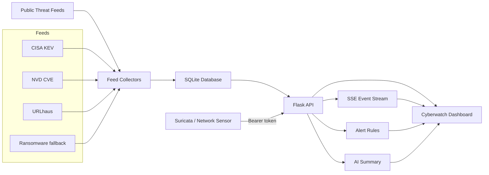

# Cyberwatch AI

Cyberwatch AI is a Flask-based cyber threat monitoring dashboard. It combines public threat-intelligence feeds, a live event stream, alert rules, an AI-style posture summary, and a rotating globe visualization for a SOC-style monitoring experience.

## Features

- Live cyber operations dashboard with terminal/SOC visual style
- Rotating globe with country outlines and threat dots
- Backend event stream with Server-Sent Events and frontend polling fallback
- Feed status panel for source health and record counts
- Sensor Health panel with heartbeat freshness, event totals, node scope counts, database state, and API latency
- Explicit `LIVE`, `FALLBACK`, and `OFFLINE` states with checked/updated timestamps
- Incident drawer for CVEs, events, ransomware records, alerts, and feeds
- AI-style threat posture summary with drivers and recommended actions
- Alert rules for exploited CVEs, critical CVEs, malware events, and ransomware intelligence
- Layered command-center layout with the globe as the central visual focus
- Threat trend chart with area fill and latest-value emphasis
- Rolling solar-wind and sensor-activity charts with live endpoint markers
- Threat-signature gauge band for malware/risk distribution
- Explicit analyzer empty state when no local sensor incidents are correlated
- Globe node colors derived from event category, with severity-based fallback for new sensor types
- SQLite persistence for CVEs, events, ransomware records, and globe markers
- Session-based login/authentication
- Feed-derived globe markers for CVE, ransomware, and event records

## Current Real Feeds

- CISA Known Exploited Vulnerabilities catalog
- NVD CVE API
- URLhaus recent malware URL reports
- ransomware.live recent victims API
- NOAA SWPC solar wind and planetary K-index feeds
- Optional Cloudflare Radar BGP/outage telemetry using `CLOUDFLARE_API_TOKEN`
- Authenticated sensor ingestion for Suricata or custom network sensors
- Native adapters for Suricata EVE, Zeek JSON, Wazuh alerts, and generic syslog/cloud events

The project also includes fallback/demo ransomware and globe marker data so the dashboard remains usable when a public source is unavailable or rate-limited.

## Architecture



## Project Structure

```text
CYBERWATCH AI/
  app.py
  api/
    dashboard.py
  database/
    db.py
    models.py
    cyberwatch.db
  intelligence/
    cve/nvd_feed.py
    malware/urlhaus_feed.py
    ransomware/ransomware_feed.py
  services/
    feed_manager.py
    scheduler.py
  static/
    css/dashboard.css
    js/dashboard.js
  tools/
    sensor_forwarder.py
  templates/
    dashboard.html
```

## Setup

Install dependencies:

```powershell
pip install -r requirements.txt
```

Run locally:

```powershell
$env:PORT='5050'
python app.py
```

Open:

```text
http://127.0.0.1:5050
```

Default local login:

```text
username: admin
password: cyberwatch
```

For production, set `ADMIN_USERNAME`, `ADMIN_PASSWORD`, and `SECRET_KEY` as environment variables. Do not use the default password on a public deployment.

Optional feed key:

```text
CLOUDFLARE_API_TOKEN=<Cloudflare API token with Radar access>
SENSOR_INGEST_TOKEN=<long random token for sensor submissions>
GEOIP_DB_PATH=<absolute path to GeoLite2-City.mmdb>
ABUSEIPDB_API_KEY=<optional AbuseIPDB API key>
RDAP_ENRICHMENT_ENABLED=false
```

`SENSOR_INGEST_TOKEN` must be present in the project `.env` file. The Flask app and
`tools/sensor_forwarder.py` both load this value from `.env`; restart both processes
after changing it. Do not reuse the Cloudflare token as the sensor token.

## API Endpoints

| Endpoint | Purpose |
| --- | --- |
| `/api/health` | Service health |
| `/api/summary` | Dashboard summary counters |
| `/api/ai-summary` | AI-style posture summary |
| `/api/feed-status` | Feed health/status panel |
| `/api/alerts` | Active alert rules |
| `/api/threat-trend` | Trend chart data |
| `/api/live-feeds` | Combined solar/BGP/outage telemetry |
| `/api/solar` | NOAA SWPC solar wind values |
| `/api/bgp` | Cloudflare Radar BGP hijack telemetry or fallback |
| `/api/outages` | Cloudflare Radar outage/anomaly telemetry or fallback |
| `/api/cves` | CVE/KEV records |
| `/api/ransomware` | Ransomware victim records |
| `/api/assets` | List or register protected assets |
| `/api/assets/<id>` | Update or remove a protected asset |
| `/api/attacks` | Globe marker records |
| `/api/events` | Latest event log records |
| `/api/events/stream` | Live Server-Sent Events stream |
| `/api/industries` | Targeted industries data |
| `/api/refresh` | Trigger backend feed refresh |
| `/api/ops/health` | Database health, sensor heartbeats, row counts, and API latency |
| `/api/sensor/ingest` | Protected ingestion endpoint for real network detections |
| `/api/incidents` | Correlated incidents produced by the analyzer |
| `/api/incidents/<id>` | Read or update incident status, owner, notes, and closure reason |
| `/api/incidents/<id>/comments` | Add analyst comments and timeline entries |
| `/api/incidents/<id>/notify` | Deliver configured email, Slack, Teams, webhook, or PagerDuty notifications |
| `/api/incidents/<id>/ai-analysis` | Generate grounded structured analysis for one local incident |
| `/api/incidents/<id>/response-actions` | List or request a controlled response action |
| `/api/response-actions/<id>/approve` | Approve a requested response action |

### Threat enrichment

Every sensor event is normalized with an enrichment object for the source and target IP. It can contain country, ASN, ISP, organization, reverse DNS, abuse reputation, malware family, threat actor, related CVEs, and first/last-seen context supplied by the sensor. `GEOIP_DB_PATH` enables MaxMind City/ASN lookups and exact database coordinates. Without that database, Cyberwatch marks the location as unavailable or as a country centroid fallback; the fallback is an approximate display position, not an attacker address. Missing WHOIS, abuse, malware, actor, and CVE context is reported as unavailable rather than invented.

### Sensor ingestion

Public feeds show threat intelligence from the internet. They do not prove that your own network was attacked. Configure Suricata, Zeek, a firewall, or another sensor to POST detections to `/api/sensor/ingest` using `SENSOR_INGEST_TOKEN`.

Example payload:

```json
{
  "events": [
    {
      "event_type": "intrusion",
      "signature": "ET SCAN Suspicious inbound connection",
      "severity": "high",
      "src_ip": "203.0.113.24",
      "dest_ip": "192.0.2.10",
      "src_country": "United States",
      "dest_country": "India",
      "source": "Suricata edge-01",
      "timestamp": "2026-09-19T16:30:00Z"
    }
  ]
}
```

The accepted detection is stored as an event and globe attack marker, then appears through the existing event stream and dashboard refresh cycle.

### Windows Suricata setup

For a real Windows network sensor, install the Windows 64-bit Suricata package from
the [official Suricata download page](https://suricata.io/download/) and install
[Npcap](https://npcap.com/). Npcap is required for live packet capture.

Confirm the installation:

```powershell
suricata -V
```

Find the active adapter address:

```powershell
Get-NetIPConfiguration |
  Where-Object {$_.IPv4DefaultGateway -and $_.IPv4Address} |
  Select-Object InterfaceAlias, InterfaceIndex, IPv4Address
```

Start Suricata from an Administrator PowerShell using the active IPv4 address:

```powershell
cd "C:\Program Files\Suricata"
New-Item -ItemType Directory -Force ".\log"
.\suricata.exe -c ".\suricata.yaml" -i "192.168.1.25" -l ".\log"
```

Replace `192.168.1.25` with the address reported by `Get-NetIPConfiguration`.
The `suricata.yaml` file must have EVE JSON enabled:

```yaml
outputs:
  - eve-log:
      enabled: yes
      filetype: regular
      filename: eve.json
      types:
        - alert
        - flow
        - dns
        - http
        - tls
```

Check that events are being written:

```powershell
Get-Content "C:\Program Files\Suricata\log\eve.json" -Wait
```

In a separate PowerShell window, run the Cyberwatch forwarder:

```powershell
cd "C:\Users\Anvin\OneDrive\Desktop\CYBERWATCH AI"
python tools/sensor_forwarder.py `
  --file "C:\Program Files\Suricata\log\eve.json" `
  --url "http://127.0.0.1:5050/api/sensor/ingest"
```

The forwarder starts at the end of the file and sends only new JSON records. Add
`--from-start` for a controlled replay. A `401` response means the Cyberwatch
process and forwarder are using different `SENSOR_INGEST_TOKEN` values; stop both,
fix `.env`, and restart them.

### Incident management

The analyzer deduplicates and groups recent sensor detections by source, target, asset, and MITRE technique. It calculates severity and confidence, carries forward enrichment evidence, and creates a timeline. Analysts can manage incidents through the drawer using these states: `new`, `investigating`, `contained`, `resolved`, and `false_positive`. Each incident supports assignment, notes, closure reason, comments, related evidence, recommendations, and an audit timeline.

When no recent sensor detections can be correlated, the Situation Analyzer displays
`NO LOCAL INCIDENTS` and identifies the expected sensor sources. Public CVEs,
ransomware reports, Cloudflare Radar data, and solar-wind telemetry are not treated
as local incidents by themselves.

### Alerting and response

Notifications are disabled unless their environment variables are configured. High and critical incidents can be delivered to email, Slack, Microsoft Teams, a generic webhook, PagerDuty, and the configured alert threshold. Critical incidents can additionally use Twilio SMS. Every delivery attempt is recorded with channel, status, timestamp, and provider response code.

Response actions are deliberately approval-gated. Analysts can request `block_ip`, `disable_user`, `isolate_endpoint`, or `create_ticket`; requests remain `pending_approval` until an analyst approves them. Cyberwatch never runs a local firewall command, disables an account, or isolates a device by itself. An approved action is sent to `RESPONSE_ACTION_WEBHOOK_URL` when configured, otherwise it remains `approved_pending_executor` and is audited.

### Production operations

The `/api/ops/health` endpoint reports database health, row counts, API latency, and the last heartbeat for each authenticated sensor. `/api/ops/audit` exposes audit records to administrators. Sensor ingestion records a heartbeat and deduplicates repeated events using a stable event hash. Retention removes old events, attacks, audit records, and delivery records according to `RETENTION_DAYS`. Requests are rate-limited in-process for local deployments, and browser mutations require a session CSRF token.

For production, set `DATABASE_URL` to PostgreSQL, `REDIS_URL` to Redis, and `QUEUE_BACKEND=redis`, then run `python tools/worker.py`. The local development adapter remains SQLite/threaded; it must not be presented as the production database/queue configuration. Use a managed secret store for all tokens, terminate HTTPS at the reverse proxy, restrict the sensor route by firewall/VPN or mTLS, and back up PostgreSQL with tested restore procedures. The current application queries remain SQLite-specific, so the PostgreSQL adapter/migration should be completed before setting `DATABASE_URL` in a production deployment.

### AI analyst

`/api/incidents/<id>/ai-analysis` is separate from the global AI-style posture summary. With `OPENAI_API_KEY`, it sends only the selected incident packet, sensor evidence, and enrichment to the configured model. Untrusted event text is explicitly treated as data, and the response is constrained to structured JSON with confidence, evidence references, citations, recommended actions, and unsupported claims. Every action remains approval-required. Without a model key or if the provider fails, Cyberwatch returns a clearly labeled grounded fallback based only on the incident evidence; it does not claim that a global feed proves a local attack.

### Asset inventory

Register protected systems through the dashboard or API. Sensor events targeting a registered active IP are linked to that asset automatically.

Example:

```powershell
Invoke-RestMethod http://127.0.0.1:5050/api/assets `
  -Method Post `
  -ContentType "application/json" `
  -Body '{"name":"Public web server","asset_type":"server","ip_address":"203.0.113.10","criticality":"critical","owner":"Platform Team"}'
```

### Native sensor formats

The ingestion endpoint accepts these formats directly:

- Suricata EVE JSON alerts with nested `alert.signature` and `alert.severity`
- Wazuh alerts with nested `rule.description`, `rule.level`, `agent`, and `data`
- Zeek JSON records from `notice`, `weird`, or `conn` logs
- Generic JSON events from Windows Event Logs, Linux authentication logs, firewalls, routers, DNS, proxy, and cloud audit pipelines

For newline-delimited JSON files, use the included forwarder:

```powershell
cd "C:\\Users\\Anvin\\OneDrive\\Desktop\\CYBERWATCH AI"
python tools/sensor_forwarder.py --file "C:\\Program Files\\Suricata\\log\\eve.json"
```

The forwarder loads `SENSOR_INGEST_TOKEN` from the project `.env` automatically. For Zeek or Wazuh, point `--file` at the JSON log file. It starts at the end of the file and forwards only new records. Use `--from-start` for a controlled replay.

## Alert Rules

Cyberwatch AI currently evaluates these rules:

- `RULE-EXPLOITED-CVE`: triggers when exploited CVEs are present
- `RULE-CRITICAL-CVE`: triggers when critical CVEs are present
- `RULE-MALWARE-SPIKE`: triggers when malware URL events are present
- `RULE-RANSOMWARE-VICTIM`: triggers when ransomware victim intelligence is present
- `RULE-NORMAL-MONITORING`: fallback when no high-risk rule is active

## Notes

This is a working local monitoring project. CVE/KEV ingestion is connected to public sources, while some datasets still use fallback/demo records until additional production feeds or API keys are configured.

## Testing

Run the automated suite with:

```powershell
pytest -q
```

The suite covers adapter normalization, Suricata replay, ingestion deduplication, incident correlation, globe-marker scope, fallback enrichment, migrations, token validation, CSRF, batch replay, and API security. The optional browser smoke test requires Playwright, a running local server, and `RUN_BROWSER_TESTS=1`.

The dashboard distinguishes `local_sensor` detections from `global_intelligence`. Cloudflare Radar, ransomware reports, CVEs, and URLhaus records are external intelligence. Solar wind is environmental telemetry. None of these alone confirms compromise of a protected asset; local incident conclusions require sensor evidence linked to an asset.

Globe node colors are data-driven: red represents ransomware/malware or critical severity, amber represents outages or high severity, violet represents BGP hijacks, blue represents scans/reconnaissance or medium severity, green represents exploits/CVEs/endpoint events or low severity, and cyan is the neutral fallback for an unclassified event. A feed containing only one event category will naturally show one dominant color; different live event categories or severities produce different colors.

During globe rotation, front-side nodes remain bright and rear-side nodes remain visible as smaller, dimmed markers instead of disappearing completely. This preserves continuity while still showing which detections are currently behind the globe.

The globe legend also shows live counts for `LOCAL SENSOR` and `GLOBAL INTELLIGENCE` nodes. Local sensor nodes come from authenticated ingestion such as Suricata; global nodes come from public threat-intelligence feeds.

Local sensor markers are considered current for 24 hours. Older sensor records remain in the database for investigation and audit history but are excluded from the live globe marker list. The marker endpoint reserves space for both recent local detections and global intelligence so a noisy DNS/mDNS sensor stream cannot hide the public threat feeds.

Recommended production upgrades:

- Replace SQLite with PostgreSQL
- Download a licensed GeoLite2 City and ASN database, then set `GEOIP_DB_PATH`
- Add AbuseIPDB or another reputation provider and keep its key server-side
- Add authenticated analyst roles and audit retention before exposing incident management publicly
- Add API keys for sources such as AlienVault OTX, Shodan, Censys, or Cloudflare Radar

## Production Deployment

### Render

This repo includes `render.yaml`.

1. Push the project to GitHub.
2. Create a new Render Blueprint or Web Service.
3. Use:
   - Build command: `pip install -r requirements.txt`
   - Start command: `gunicorn app:app`
4. Set environment variables:
   - `FLASK_DEBUG=0`
   - `HOST=0.0.0.0`
   - `SECRET_KEY=<secure random value>`
   - `ADMIN_USERNAME=<admin username>`
   - `ADMIN_PASSWORD=<secure password>`
   - `DATABASE_URL` is provisioned by the included Render database resource

### Railway

This repo includes `railway.json`.

1. Create a new Railway project from GitHub.
2. Railway/Nixpacks will install from `requirements.txt`.
3. Start command: `gunicorn app:app`.
4. Add the same environment variables listed above.

### VPS

```bash
python -m venv .venv
source .venv/bin/activate
pip install -r requirements.txt
export FLASK_DEBUG=0
export HOST=0.0.0.0
export PORT=5050
export SECRET_KEY='change-me'
export ADMIN_USERNAME='admin'
export ADMIN_PASSWORD='change-me'
gunicorn app:app --bind 0.0.0.0:5050
```

Use Nginx as a reverse proxy and enable HTTPS with Certbot for a public VPS.

### Docker production stack

The repository includes `docker-compose.production.yml` with PostgreSQL, Redis, Gunicorn, and an RQ worker:

```powershell
Copy-Item .env.example .env.production
# Set POSTGRES_PASSWORD, SECRET_KEY, ADMIN_PASSWORD, and SENSOR_INGEST_TOKEN in .env.production
docker compose --env-file .env.production -f docker-compose.production.yml up -d --build
```

The app runs on port `5050` by default. Put it behind an HTTPS reverse proxy before exposing it publicly. PostgreSQL data and Redis queues use named persistent volumes; configure external backups and restore tests for production.

Run migrations explicitly during deployment with `python tools/migrate.py`; startup also applies the same idempotent schema initialization before serving traffic.

## Geolocation Notes

Globe dots are generated from:

- ransomware victim country
- CVE vendor/project country mapping
- malware/event source category
- fallback seed markers

For higher accuracy in production, add IP/ASN intelligence sources such as Shodan, Censys, GreyNoise, AbuseIPDB, AlienVault OTX, or Cloudflare Radar and resolve IPs/ASNs to country and coordinates.
