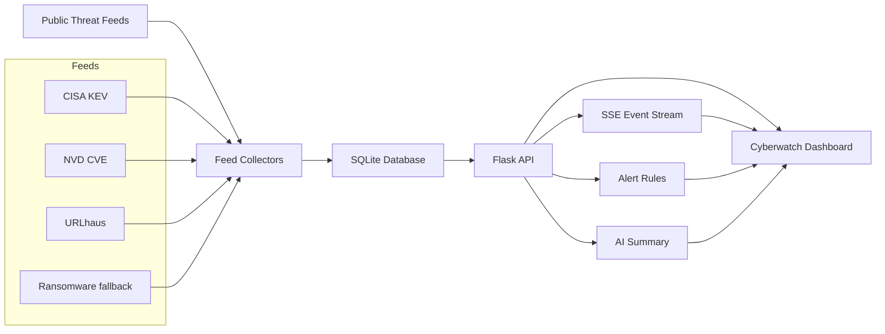

# Cyberwatch AI

Cyberwatch AI is a Flask-based cyber threat monitoring dashboard. It combines public threat-intelligence feeds, a live event stream, alert rules, an AI-style posture summary, and a rotating globe visualization for a SOC-style monitoring experience.

## Features

- Live cyber operations dashboard with terminal/SOC visual style
- Rotating globe with country outlines and threat dots
- Backend event stream with Server-Sent Events and frontend polling fallback
- Feed status panel for source health and record counts
- Incident drawer for CVEs, events, ransomware records, alerts, and feeds
- AI-style threat posture summary with drivers and recommended actions
- Alert rules for exploited CVEs, critical CVEs, malware events, and ransomware intelligence
- SQLite persistence for CVEs, events, ransomware records, and globe markers
- Session-based login/authentication
- Feed-derived globe markers for CVE, ransomware, and event records

## Current Real Feeds

- CISA Known Exploited Vulnerabilities catalog
- NVD CVE API
- URLhaus recent malware URL reports

The project also includes fallback/demo ransomware and globe marker data so the dashboard remains usable when a public source is unavailable or rate-limited.

## Architecture



## Project Structure

```text
CYBERWATCH AI/
  app.py
  api/
    dashboard.py
  database/
    db.py
    models.py
    cyberwatch.db
  intelligence/
    cve/nvd_feed.py
    malware/urlhaus_feed.py
    ransomware/ransomware_feed.py
  services/
    feed_manager.py
    scheduler.py
  static/
    css/dashboard.css
    js/dashboard.js
  templates/
    dashboard.html
```

## Setup

Install dependencies:

```powershell
pip install -r requirements.txt
```

Run locally:

```powershell
$env:PORT='5050'
python app.py
```

Open:

```text
http://127.0.0.1:5050
```

Default local login:

```text
username: admin
password: cyberwatch
```

For production, set `ADMIN_USERNAME`, `ADMIN_PASSWORD`, and `SECRET_KEY` as environment variables. Do not use the default password on a public deployment.

## API Endpoints

| Endpoint | Purpose |
| --- | --- |
| `/api/health` | Service health |
| `/api/summary` | Dashboard summary counters |
| `/api/ai-summary` | AI-style posture summary |
| `/api/feed-status` | Feed health/status panel |
| `/api/alerts` | Active alert rules |
| `/api/threat-trend` | Trend chart data |
| `/api/cves` | CVE/KEV records |
| `/api/ransomware` | Ransomware victim records |
| `/api/attacks` | Globe marker records |
| `/api/events` | Latest event log records |
| `/api/events/stream` | Live Server-Sent Events stream |
| `/api/industries` | Targeted industries data |
| `/api/refresh` | Trigger backend feed refresh |

## Alert Rules

Cyberwatch AI currently evaluates these rules:

- `RULE-EXPLOITED-CVE`: triggers when exploited CVEs are present
- `RULE-CRITICAL-CVE`: triggers when critical CVEs are present
- `RULE-MALWARE-SPIKE`: triggers when malware URL events are present
- `RULE-RANSOMWARE-VICTIM`: triggers when ransomware victim intelligence is present
- `RULE-NORMAL-MONITORING`: fallback when no high-risk rule is active

## Notes

This is a working local monitoring project. CVE/KEV ingestion is connected to public sources, while some datasets still use fallback/demo records until additional production feeds or API keys are configured.

Recommended production upgrades:

- Replace SQLite with PostgreSQL
- Add API keys for sources such as AlienVault OTX, Shodan, Censys, AbuseIPDB, or Cloudflare Radar

## Production Deployment

### Render

This repo includes `render.yaml`.

1. Push the project to GitHub.
2. Create a new Render Blueprint or Web Service.
3. Use:
   - Build command: `pip install -r requirements.txt`
   - Start command: `gunicorn app:app`
4. Set environment variables:
   - `FLASK_DEBUG=0`
   - `HOST=0.0.0.0`
   - `SECRET_KEY=<secure random value>`
   - `ADMIN_USERNAME=<admin username>`
   - `ADMIN_PASSWORD=<secure password>`

### Railway

This repo includes `railway.json`.

1. Create a new Railway project from GitHub.
2. Railway/Nixpacks will install from `requirements.txt`.
3. Start command: `gunicorn app:app`.
4. Add the same environment variables listed above.

### VPS

```bash
python -m venv .venv
source .venv/bin/activate
pip install -r requirements.txt
export FLASK_DEBUG=0
export HOST=0.0.0.0
export PORT=5050
export SECRET_KEY='change-me'
export ADMIN_USERNAME='admin'
export ADMIN_PASSWORD='change-me'
gunicorn app:app --bind 0.0.0.0:5050
```

Use Nginx as a reverse proxy and enable HTTPS with Certbot for a public VPS.

## Geolocation Notes

Globe dots are generated from:

- ransomware victim country
- CVE vendor/project country mapping
- malware/event source category
- fallback seed markers

For higher accuracy in production, add IP/ASN intelligence sources such as Shodan, Censys, GreyNoise, AbuseIPDB, AlienVault OTX, or Cloudflare Radar and resolve IPs/ASNs to country and coordinates.
